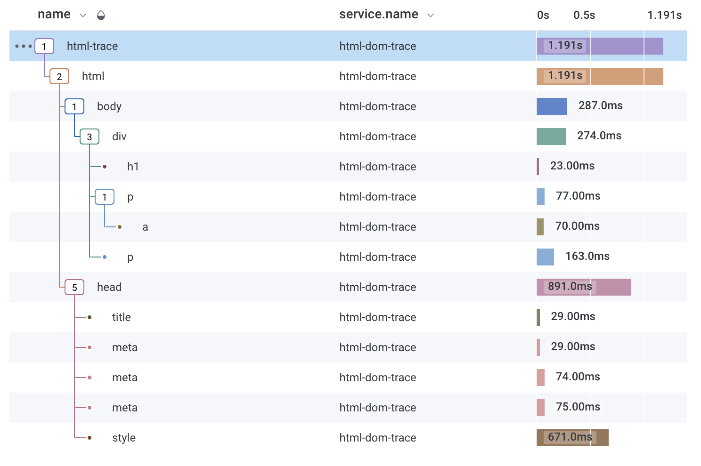

# html-dom-trace
NodeJS CLI to fetch and parse a HTML document, model the DOM as a Trace and send it to HoneyComb.

Each DOM element is represented as a trace span, in which their span's duration is the estimated span's size (including children). All element attributes are mapped as span fields. This tool's purpose is to help detect big DOM subtrees (similar goal and implementation as [html-size-visualizer](https://github.com/fedebertolini/html-size-visualizer), with a different visualization tool).



## Installation

Install CLI as global package: `npm i -g html-dom-trace`

## Usage
`$ html-dom-trace <url> [options]`

**Options:**
- `--hc-key`: HoneyComb API Key
- `--hc-dataset`: HoneyComb Dataset name  (default html-dom-trace)
- `-v, --version`: Displays current version
- `-h, --help`: Displays this message

**Examples**
```
$ html-dom-trace https://www.example.com --hc-key=1234567890 --hc-dataset=html-traces
```